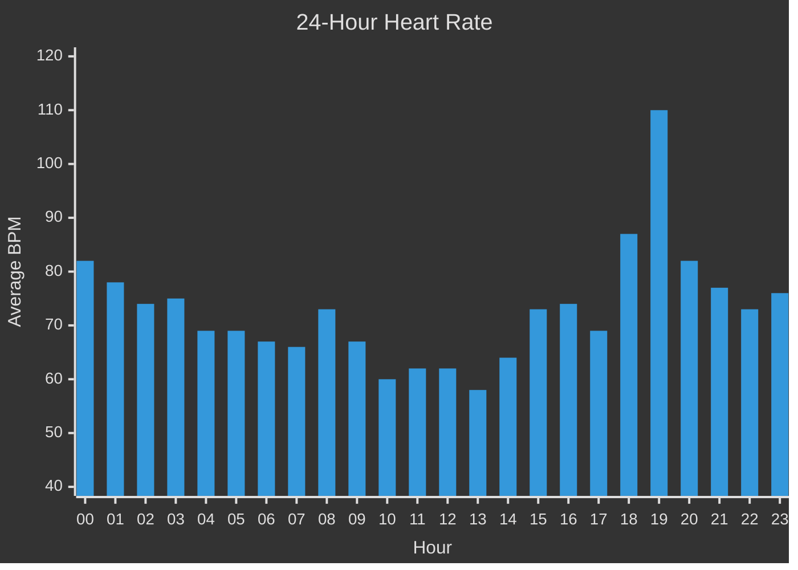

# Data

## 2025-12-30

### Heartrate

**Heart Rate Chart:**

### Readiness

| Field | Value |
|-------|-------|
| Day | 2025-12-30 |
| Score | 58 |
| Temperature Deviation | -0.29 |
| Temperature Trend Deviation | -0.08 |

#### Contributors

| Field | Value |
|-------|-------|
| Activity Balance | 65 |
| Body Temperature | 95 |
| HRV Balance | 73 |
| Previous Day Activity | 52 |
| Previous Night | 47 |
| Recovery Index | 6 |
| Resting Heart Rate | 100 |
| Sleep Balance | 47 |
| Sleep Regularity | None |

### Sleep

| Field | Value |
|-------|-------|
| Day | 2025-12-30 |
| Score | 65 |

#### Contributors

| Field | Value |
|-------|-------|
| Deep Sleep | 97 |
| Efficiency | 98 |
| Latency | 70 |
| REM Sleep | 71 |
| Restfulness | 95 |
| Timing | 11 |
| Total Sleep | 45 |

### SPO2

| Field | Value |
|-------|-------|
| Day | 2025-12-30 |
| Breathing Disturbance Index | 11 |

#### SPO2 Percentage

| Field | Value |
|-------|-------|
| Average | 95.435 |

### Stress

| Field | Value |
|-------|-------|
| Day | 2025-12-30 |
| Day Summary | normal |
| Recovery High | 2700 |
| Stress High | 8100 |

